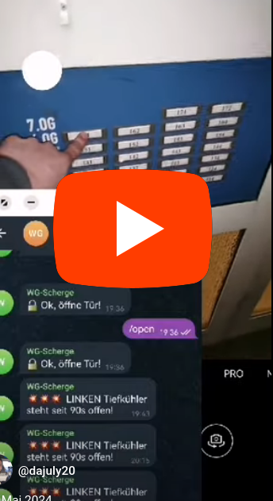
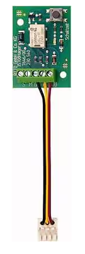
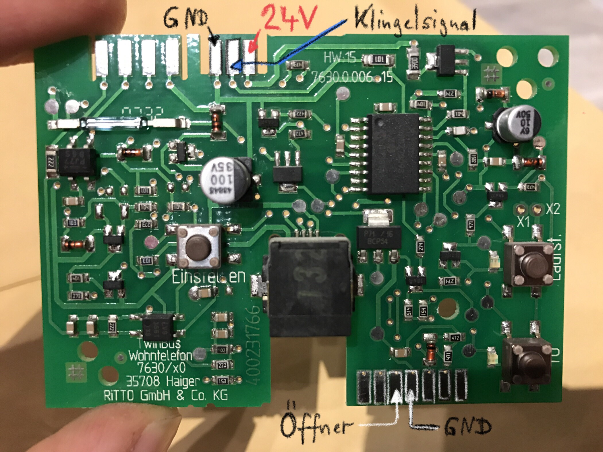
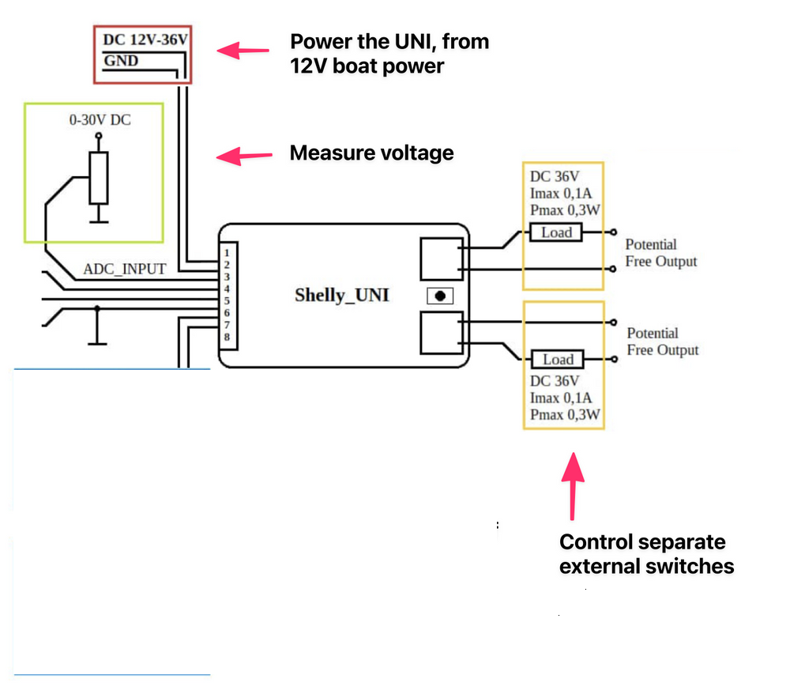
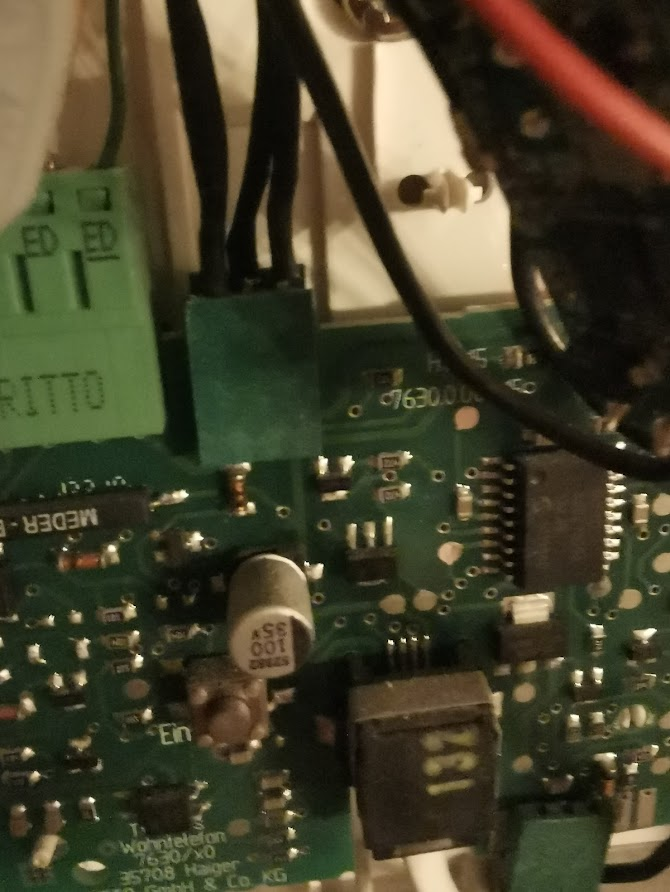
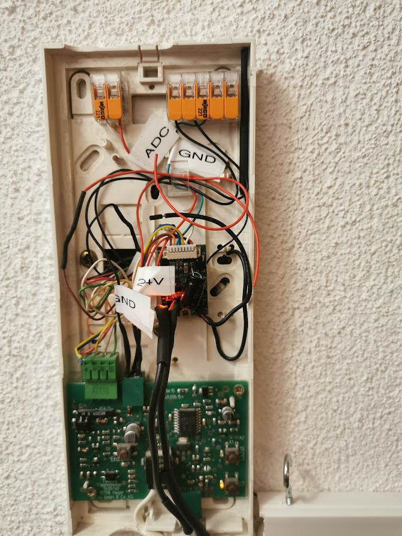
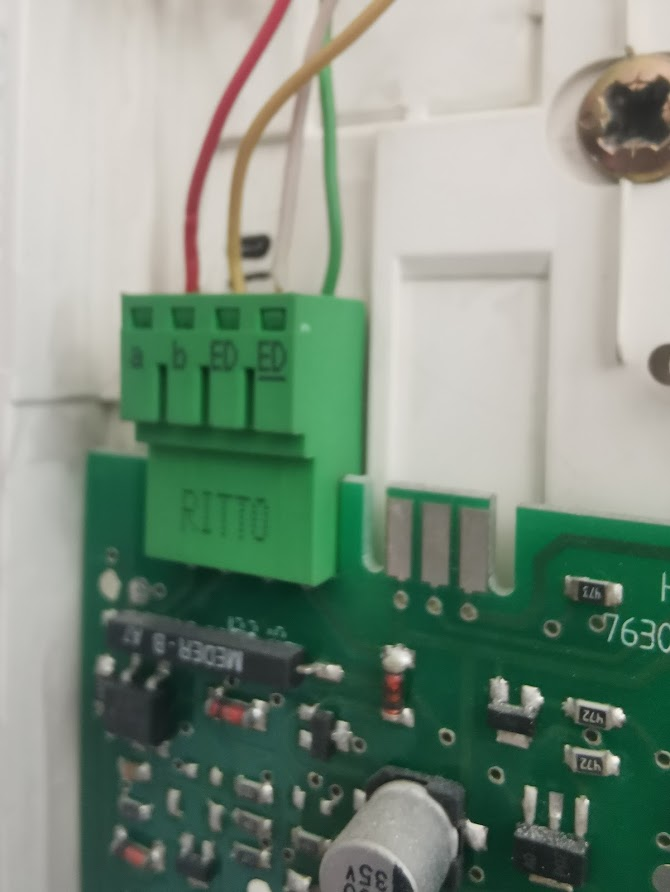
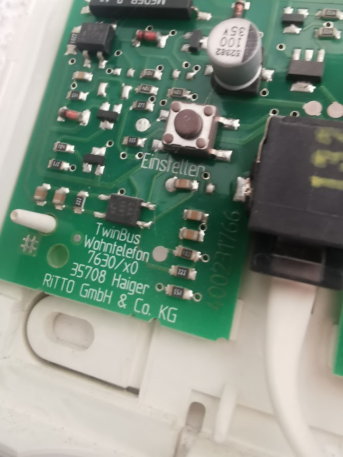

# Ritto Doorcom
**Supports receive ringing bell & trigger door buzzer** ( This does NOT enable audio streming from / to the door! )
This project puts a shely uni into the casing of a ritto doorcom within your unit.

**Update:** I started this project reading the bell signal directly from the ritto board using the analog to digital converter of the shelly uni. **THIS suddently just stopped working!**
I then had to order [Rufanschaltrelaid on Amazon](https://www.amazon.de/Ritto-1545763-1764600-Rufanschaltrelais/dp/B000ONN406/)

 Note: A few month out, it stopped working. I'm read about other people running into the same issue. Solution: Give money to Ritto 

For now im just copying in schematics - will do the rest another time 

Play Video on YouTube

https://www.youtube.com/shorts/SWz1PtIJtWo

https://www.mikrocontroller.net/topic/345385
https://www.youtube.com/watch?v=jkPvWSx4A8U
https://asset.conrad.com/media10/add/160267/c1/-/de/000469693ML01/04-Bedienung.pdf

TODO: Picture of setting with the new Relay! 
TODARE: Open that thing up again with a chance of having it closed again....

 
