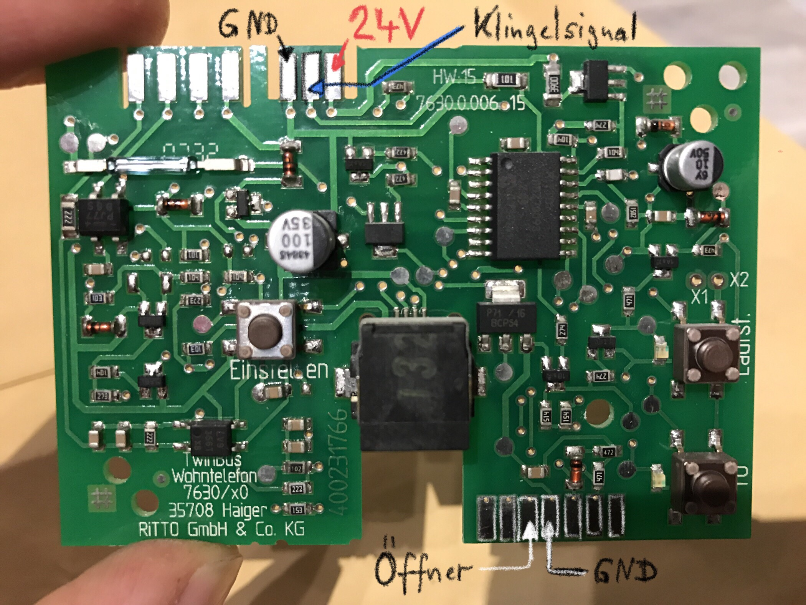
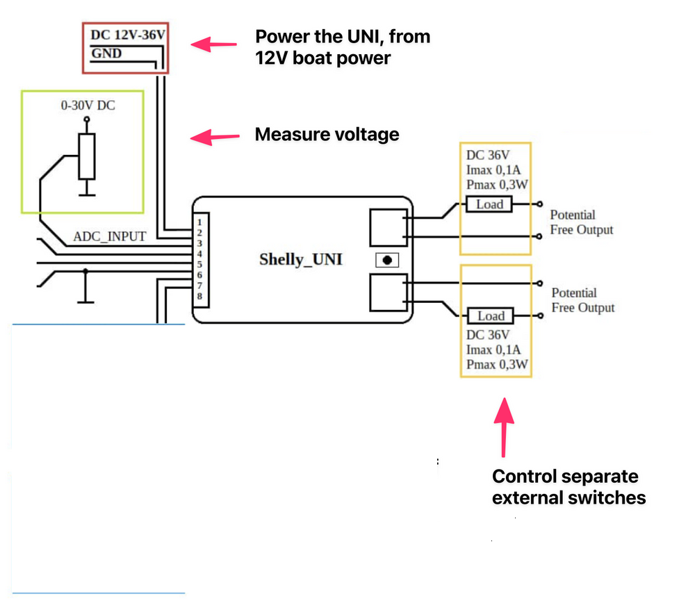

# ritto_intercom_shelly_uni
This project puts a shely uni into the caseing of the ritto intercom within your flat. Supported: Forward Bell signal + Send Door Open

Note: A few month out, it stopped working. I'm read about other people running into the same issue. Solution: Give money to Ritto 
For now im just copying in schematics - will do the rest another time 

https://www.mikrocontroller.net/topic/345385
https://www.youtube.com/watch?v=jkPvWSx4A8U
https://asset.conrad.com/media10/add/160267/c1/-/de/000469693ML01/04-Bedienung.pdf
https://www.amazon.de/Ritto-1545763-1764600-Rufanschaltrelais/dp/B000ONN406/ref=asc_df_B000ONN406/?tag=googshopde-21&linkCode=df0&hvadid=231877237116&hvpos=&hvnetw=g&hvrand=3166824181021876623&hvpone=&hvptwo=&hvqmt=&hvdev=c&hvdvcmdl=&hvlocint=&hvlocphy=9068547&hvtargid=pla-422398879823&psc=1&th=1&psc=1

